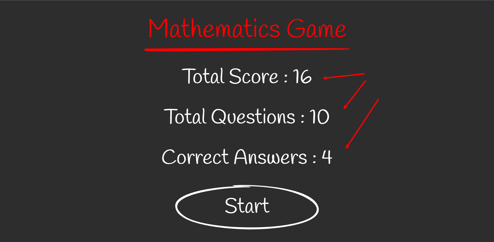

# week4-assignment

## **Multiplication App**

---

Multiplication is more fun now.
A game made with React.
10 multiplication questions are asked.
Wait 3 seconds after each answer.
It shows whether the given answer is correct or not.
After 10 questions, all questions will be listed on the final page, and the correctness of your answers will also be shown.

## **Requirements**;

---

### <u>_Home page;_</u>

- In localstorage, total score, total number of solved questions, total number of correct answers are taken.
- If this data does not exist in localstorage, this data is created as 0.

---

### <u>_Game page;_</u>

- 2 numbers are chosen randomly from 1 to 10.
- 3 options are selected, 1 true and 2 false.
- The creation of wrong answers is done as follows;
  For example, if the question is 7x8;
  correct answer 56
  For the 1st wrong answer, one of the numbers 7 or 8 is subtracted by one and the operation is done. Let's say the number 8 is chosen. 8-1 = 7, 7 x 7 = 49
  The second wrong answer is taken and the other number is increased by one, the operation is done. We used 8 in the 1st wrong answer, now we use 7. 7 + 1 = 8, 8x8=64
  So our options are : [56, 49, 64]
  If an incorrect answer is given, no points are awarded.
  If the correct answer is given, the square root of the correct answer is taken and added to the score. If there is no whole number, it is rounded up and added to the score.

---

### <u>_Final page;_</u>

- After completing 10 questions, the final page opens.
- Its rating is shown in 10 questions.
- The correctness of the answers to the questions is also shown.
- Localstorage is updated on this page.
- When the Restart button is pressed, the question page is returned again. The number of rounds is increased by one

---

### <u>_Additional;_</u>

- If the user cannot reach the final page while on the game screen (refreshes the page or exits the game), the points are not added to the localstorage.

- The minimum desired screen width is 1024. Smaller screens don't matter.

---

**App Preview;**

**The homepage that appears after the game. Retrieval of data from localstorage;**

